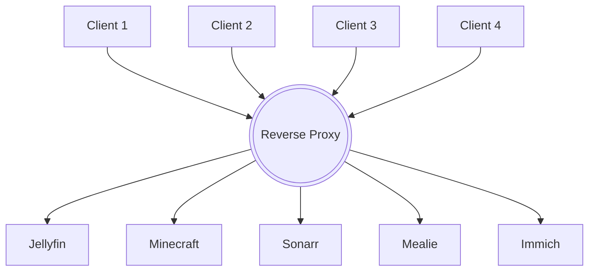

So you've come into ownership of a domain name. You bought one from a registrar, inherited one, maybe got one for free from a drop. You would also like to expose multiple services you self host to the internet... But you only have one domain. Maybe you've tried messing with A, CNAME and SRV records from your DNS provider to transform your one domain into a Swiss army knife of external access, and promptly realised too many of them were using the same port(s) on your router.

If that problem sounds familiar, then the solution is in this document. And it's called **Nginx Proxy Manager**

## Concepts
[Skip to the next section](#deploying-nginx-proxy-manager) if you're already familiar with how domain names and DNS resolution work.
### Domain names


Domain names are limited, as you've come to understand. You can purchase and own as many of them as you want to, but they're very simple in nature: an easily remembered name, a dot, and a top-level domain. A concrete example is **Wikipedia**.

Wikipedia's Fully Qualified Domain Name ([FQDN](https://en.wikipedia.org/wiki/Fully_qualified_domain_name)) is `wikipedia.org.`. Notice the trailing `.` at the end. That dot is not an error, it is actually what's referred to as the `root zone`. Domain names are read from right to left, with the same logic as a Linux filesystem:

- First you read the trailing `.`, you are at the root. In a Linux filesystem, it's the `/`.
- Then you read the Top Level Domain, in our case, `org`
- Then you read another dot, marking another step in the tree structure of the domain name
- Lastly, you read the domain name itself: `wikipedia`

{: w="450"}
_[Source](https://en.wikipedia.org/wiki/Fully_qualified_domain_name)_

If it were a Linux filesystem, this FQDN could be rewritten as `/org/wikipedia`{: .filepath}

### Subdomains
But that's not how you access Wikipedia. If you visit it, you will notice you always have something that comes before `wikipedia.org`. Be it `www` if you want to choose your language, `en` to read Wikipedia in English, `es` for Spanish, `ja` for Japanese or even `tlh` and `fr` for made-up languages like Klingon and French. Those parts of the Domain Name are called **subdomains**.

Subdomains are the next step in the tree-like domain resolution system. Once you own a domain, you the owner can create as many subdomains as you wish for.
> You are still limited by two hard coded rules:
> - Subdomain names can't get over 63 characters long
> - Domain names can't get longer than 255 characters total, full stops included
{: .prompt-info}

Subdomains is what the Wikimedia foundation uses to serve Wikipedia in different languages so elegantly. The different web servers that host those versions of Wikipedia aren't even aware of it, because there is no need for them to be.

Wouldn't it be great if we could do the same at home?


## Nginx Proxy Manager

### What is Nginx Proxy Manager?
[Nginx Proxy Manager (NPM)](https://nginxproxymanager.com/) is a fully self-hostable instance of the [Nginx](https://www.nginx.com/) reverse proxy, with a simple and extremely effective web interface, created and maintained by [Jamie Curnow](https://jc21.com/). It is a piece of software that sits between the internet and your services, that will route traffic coming from the internet to your services based on the subdomain that was requested.



Thanks to its nature, if you own `myhomelab.net`, NPM allows you to spawn `jellyfin.myhomelab.net`, `minecraft.myhomelab.net` and `sonarr.myhomelab.net` without having to configure anything else on the aforementioned services themselves, just like on Wikipedia.

### Deploying Nginx Proxy Manager
NPM is [only available as a containerised application](https://nginxproxymanager.com/faq/#do-i-have-to-use-docker). I use [Docker](https://www.docker.com/) in my homelab as my containerisation engine of choice, and Debian Linux as my operating system ([Why?]())

For a more in-depth explanation, as always, [follow the official documentation.](https://nginxproxymanager.com/guide/#quick-setup)

Start by building a [docker compose](https://docs.docker.com/compose/compose-application-model/) script and save it as `docker-compose.yml` on your machine.

```yaml
version: '3.8'
services:
  app:
    image: 'jc21/nginx-proxy-manager:latest'
    restart: unless-stopped
    ports:
      - '80:80'
      - '81:81'
      - '443:443'
    volumes:
      - ./path/to/npm/data:/data
      - ./path/to/npm/letsencrypt:/etc/letsencrypt
```

Bring it up using the following command in the same folder as your docker-compose.yml

```bash
docker compose up -d
```

The NPM web interface is now accessible on that machine on port 81, on your machine. Mine is at `http://192.168.1.34:81`.
Log in to the UI with the default credentials

```yml
email: admin@example.com
password: changeme
```
{: file="credentials" }
Upon logging in, you will immediately be prompted to change those credentials.

# Proxying services through NPM
Now that NPM is up and running, time to proxy our services. Make sure your domain name is pointing towards your router's public IP, and that your router's NAT rules redirect all requests on port 80 and 443 to NPM. The process varies too much from router to router to detail it here.

Now choose a service you want to proxy. I'll take [Jellyfin](https://jellyfin.org/) for my example.

> You will expose your services to the internet! If the service you expose doesn't have any authentication built-in and/or contains sensitive info, **DO NOT EXPOSE IT**. See [this reddit post](https://redd.it/shukle) to understand why.
{: .prompt-danger }

> NPM has a baked-in feature to secure clients who do not offer this functionality, called *Access List*. I won't delve into it in this document, so in the meantime, please do not expose services with no authentication method to the internet.
{: .prompt-warning}

To proxy a service through NPM, go to `Hosts > Proxy Hosts` in the top bar. Then, click "Add Proxy Host" on the top right. You are now presented with the following screen

{: w="350"}{: .right}

- `Domain Names` is a list of names you want to give your service, say `jellyfin.myhomelab.net`. You can specify multiple if you need to, one is usually perfectly sufficient.
- `Scheme` should be `http`, unless the service you wish to proxy is already using https (do not forget to NAT port 443 to NPM in your router if that's the case!)
- `Forward IP` is the IP of the machine hosting your service. In my case, `192.168.0.124`
- `Forward Port` is the port your service exposes, Jellyfin uses `8096` by default.
- Ticking "Block common exploits" is a good idea. Keep in mind your services will be exposed to the internet, and bots crawl for open ports all the time.

<!-- {: w="400"} -->

If all went well, NPM is now proxying your service, which you can make sure of by checking the `Status` of then entry you just created


## SSL Certificates
### Creating SSL certificates
Optionally, NPM offers the possibility to generate SSL/TLS certificates for your services, provided by [Let's Encrypt](https://letsencrypt.org/). While self-signed ceftificates are nice, they can easily be created by anyone for any service, and are thus considered insecure by default for any modern browser. Let's Encrypt is a third party, that will sign the certificate for you, thus making it peer-reviewed, and trustworthy in the eyes of your browser.

I am used to generating what's known as *wildcard certificates*, which are available to use for your entire domain. They're a bit more involved to generate, since you need to setup a DNS provider (like Cloudflare) first, but it's a one time operation. If you prefer, you can also generate one certificate per service you wish to proxy.

{: .right}{: w="400"}

NPM streamlines the SSL certificate creation process as much as possible for its end user.
- Go to `SSL Certificates` in the top bar, and click on `Add SSL Certificate` > `Let's Encrypt`.
- Enter the domain name you have pruchased into the `Domain Names` section.
- Enter the email address that will be publicly available on the certificate.
- Since I have setup Cloudflare ([How?]()), I will choose `Use a DNS Challenge` with `Cloudflare` as my `DNS Provider` to generate a wildcard certificate for my homelab.
- [Generate an API Token]() in the Cloudflare dashboard, and paste it after the `=` sign.
- Agree to the Let's Encrypt Terms of Service.

Double check the information you have entered, and click `Save`. It will take a minute or two for NPM to contact the Let's Encrypt servers using [Certbot](https://certbot.eff.org/), and save your certificates locally. Once it's done, the wildcard certificate you have generated will appear as an entry in the table of SSL Certificates


### Apply a certificate to a Host

To benefit from the certificate(s) you have created, they have to explicitly be applied to a Host.
- Go back to `Hosts` > `Proxy Hosts` where you had created the proxy connection.
- Edit the Host you had created using the three dots on the far right.
- Go the the `SSL` tab.
- Click on the `SSL Certificate` dropdown menu, and choose
  - The wildcard certificate for your domain;
  - `Request a new SSL certificate` to generate a certificate for this subdomain only;
  - `None` if you have changed your mind and don't want to use HTTPS anymore.
- `Force SSL` and enable `HTTP/2` support

{: w="400"}

Your Host should now display `Let's Encrypt` in the `SSL` columns


> Congratulations, you have now installed Nginx Proxy Manager, generated SSL certificates and securely exposed a service to the internet!
{: .prompt-tip}

## Wrapping up

This was a doozy to write, as I wanted it do be easily followed, but also explain the all-elusive ***Why does this work?***. Because, having something that works feels great, but nowing why something works is a lifesaver. If I personally don't get this intuitive sense of why something works, there is no way I could use it correctly or service it when, undoubtedly, something goes wrong.