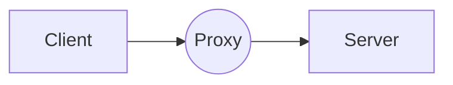

## Disclaimer
This whole article will sound like a paid promotion for Cloudflare, but I assure it is not. It is simply a happy customer telling his tale of how happy he is with their product.

## Cloudflare
### What is Cloudflare?
Cloudflare is a company offering a *lot* of different services. Tunnels, filtering, proxy, DNS, domain name registration and mostly anything networking related that can be provided as a service. For our purpose though, we're going to use their DNS service, as well as their proxying capabilities.

Somewhat opposite to the Reverse Proxy principle that I detailed in the [Deploying Nginx Proxy Manager with SSL certificates](){: .filepath}, which takes multiple connections and routes them to multiple hosts downstram, a **Forward Proxy** (or simply proxy) will take one connection at a time, and send it to one single host downstream. That _sounds_ like adding a useless step in routing, but a proxy does not simply pass a connection along: it isolates the client from the server, and allows no direct connection between the two. On top of that, a Proxy monitors the connection, and can act on it should need be, like a friendly Man in the Middle.

### What we'll use
The first function we're going to use is the **DNS** service. Domain Name Service, or DNS, is, simply put, the service that transforms `www.google.com`{: .filepath} into `142.250.179.164`{: .filepath}. It's a vertebra in the backbone of our modern internet, without which we'd all be stuck trying to remember IP addresses. 
Cloudflare's DNS service allows us to direct visitors of `www.myhomelab.net` to our home router, that will then forward the request to our homelab (hopefully to a firewall and reverse proxy beforehand!). 

The second function we're going to use is **proxying**. Proxying a service through Cloudflare will help you achieve SSL encryption in one click, and the inherent connection security that comes with HTTPS. They also actively monitoring the connection for potention Denial of Service (DoS) attacks, and offer you a one-click "I'm under attack!" button to stop all requests to your service, until the attack stops.

### Cloudflare is not self-hosted
You might have noticed that all these *Cloud* services are run through a third-party host, and you're right. All those Cloudflare services are not self-hosted. As far as I know though, there is no other way to achieve public DNS resolution without a third-party host, be it Cloudflare, Google, your ISP's DNS or your registrar's DNS. Someone, at some point, needs to propagate the information that `www.myhomelab.net` is at `142.98.57.113`, so that outside requests for your homelabe know where your network is on the internet. 
What you can do though, is host your own recursive DNS server, which will bypass your ISP's and contact the root DNS servers itself for all requests coming from your LAN into the internet. A writeup on that is coming... At some point.

## Protecting your homelab with Cloudflare
### Adding your domain name
After signing up, head to [the Cloudflare dashboard](https://dash.cloudflare.com/), select `Websites` on the left navbar, and click `Add a site`

Enter your domain, and click `Continue`. Then select the Free plan.
> Your domain is now linked to Cloudflare!
{: .prompt-tip}

All is not done yet though, your registrar is not yet using the Cloudflare DNS. You will need to explicitly tell your registrar that they should use Cloudflare's DNS when people want to reach your services. The process varies a lot for each registrar, but in essence it's pretty simple. Mine is [Hetzner](https://www.hetzner.com), and domain names are administered via `KonsoleH`{: .filepath}.

To change my nameservers, I go to `Products` > `Services` > `DNS Administration` > `Change nameservers`

The nameservers that were assigned to me are `nena.ns.cloudflare.com.` and `roan.ns.cloudflare.com.`. They're found on your Cloudflare Dashboard, at the bottom of the `DNS` tab.

Once assigned, it will take from a few minutes to a full day for your registrar to start using Cloudflare. In the meantime, you can start adding records!

### Pointing Cloudflare at your home router
To point Cloudflare to your home network, you need to add a **record**. Records are used by DNS servers as rules, and different types of records mean different things. More information can be found [on Cloudflare's site itself](https://www.cloudflare.com/learning/dns/dns-records/).  
For our purposes, we're simply going to use the lowly `A` and `AAAA` records. Their respective roles are to associate a (sub)domain with an IPV4 or IPV6 address, which is exactly what we're looking for!

Once you have the address of your home router (which you can usually find in its web interface, or by visiting any [What is my IP?](https://www.whatismyip.com/) type of site), go back to the [dashboard](https://dash.cloudflare.com/), in the `DNS` tab and click `Add record`. What we want to accomplish here is to route all the traffic coming to our domain to our router, but Cloudflare asks for a `Name` for our record. The `Name` is the subdomain we will type in our address bar, but people could type anything in their address bar. The solution: the allmighty **wildcard `*`**!  
Specifying a wildcard as a subdomain name will pattern match all subdomains, and route the traffic to the IP address we indicate in the record. Add a record like so and save it:

> Cloudflare has a great system regarding subdomains. If you specify the wildcard `*` subdomains along with other subdomains, such as `immich.myhomelab.net` for example, it will route all traffic that is NOT `immich.` to the wildcard, and all `immich.` traffic to the `immich.` record. 
> You can write as many as needed, and **the more specific rule prevails!**
{: .prompt-info}

> All requests for your domain now go through Cloudflare, who redirects them to your router. Good job!
{: .prompt-tip}

### Proxying services that are not on your LAN
You might own a website, that you host at Linode, Digital Ocean, Hetzner, GitHub Pages (like this very website!) or any other VPS, in which case you can't simply redirect connections to your router at home. But Cloudflare has you covered too!

As always, you'll need to grab the IP of the service you want to proxy. I'll use `10.58.149.72`{: .filepath} as an example.
Then, head to [the Cloudflare dashboard](https://dash.cloudflare.com/), and add an `A` record (or `AAAA` record if you use IPV6) and specify the subdomain you want to use. If I wanted to proxy my [Immich](https://immich.app/) photo gallery via `immich.myhomelab.net`, I'd add a record just like this:

In the end, my config will look something like this

> Services behind a singular domain name do not need to be on the same LAN! 
> As you can see, I direct to two very distinct IP addresses in my configuration. That's the power of `A(AAA)` records!
{: .prompt-info}

### To proxy or not to proxy?
In both our `A` records, we have left the `Proxy status` checkbox ticked. But some services don't need it, and some might even outright refuse to work with proxying enabled. I have only once encountered that use case, and it was with a minecraft server that I was hosting. Running it proxied through Cloudflare, and not simply DNS'd, made it unresolvable to a Minecraft client. Thankfully, it could be left unproxied and unmonitored, without being a vulnerability.  
Proxying can only be disabled, using the slider option in the record, should you notice it's unneeded, or counter-productive.

## Bonus: Generate an API token for use with Let's Encrypt
If you're using a reverse proxy such as [Nginx Proxy Manager](https://nginxproxymanager.com/) at home (and if you're not yet, [check out the writeup on it]()), then you might want to setup SSL certificates for it. More specifically, because you're ~~lazy~~ efficient, a wildcard certificate. But to do that, you need to prove your ownership of the 2LD, and Cloudflare can warrant that for you, via an API token.  
To generate one, go to your dashboard, `Overview` and click on `Get your API token` on the bottom right. Or click [here](https://dash.cloudflare.com/profile/api-tokens) to directly go there, because you're efficient. Then click `Create Token` > `Create Custom Token` at the very bottom.
Give it a name, and setup the rest of the permissions as so:

Once you click `Continue`, you will be shown a summary with your email address, domain name and `DNS:Edit` next to it. Click on `Create Token`, and it will show you the token. Copy it and save **don't close the tab**. That token will **not** be shown to you again, so, while you have not finished with it yet, keep the tab open. Once you're finished, you can click Finish.

## Wrapping up
You have now setup Cloudflare for your own domain. Not only that, but the services behind your domain name are publicly accessible, secured via HTTPS, and you might even have unified different LANs under a common domain name.

> Good job!
{: .prompt-tip}
