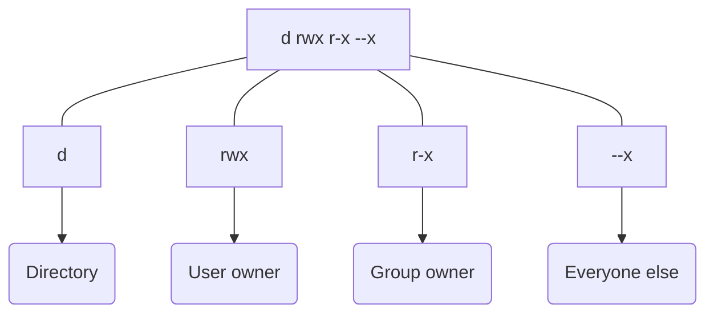

Strap in cause this one's a doozy.

In this writeup, I'm detailing how I set up centralised authentication to Windows and Linux clients, using a Windows Server VM, running Active Directory. I'll also use said Active Directory to manage access rights to datasets in TrueNAS Scale 23 (Cobia), as well as *lightly* touch upon how Linux permissions work. Just a little.

> If you're able to, create a whole new TrueNAS install and migrate your data there, so as not to have legacy stuff you had made that could interfere with the new approach to permissions you're about to undertake.
{: .prompt-warning}

## Linux permissions
If you have a good grasp of how Linux permissions work within a given OS and through network shares, feel free to skip this.
### How are permissions handled on Linux systems?
Before getting into the meat of it all, as always, let's dive into **why** it makes any semblance of sense to use a Windows Server machine to manage our credentials. Linux can do it very well on its own, and we never even give it a second thought when logging in via our favourite SSH client. So how does Linux do it?

Linux uses **Users**, and stores its users into **Groups**. Each file on a Linux system possesses attributes relating to that:
- A user who owns the file, the `user owner`
- A group that owns the file, the `group owner`
- A whole lot of gibberish that contains `d`, `r`, `w`, `x` and `-` in a seemingly random arrangement

All of these informations can be accessed at any time, for any file or directory, using `ls -l`

>  Prepend a command with `man` to know more about how to use it <br>
> ```bash
> $ man ls
> ```
{: .prompt-tip}

Here's a sample output of `ls -l`, that I'll use to break down permissions:
```bash
drwxr-xr-x 5 bob bob 4096 29 feb 12:47 images_bob
drwxrwxr-x 2 bob alice 4096 28 feb 13:45 data_users
-rwx------ 1 root root 737 29 feb 20:18 secret_file
-rwxrwxrwx 1 alice alice 737 29 feb 20:18 public_file
```

> I will consciously ignore part of the output that is unrelated to the concept of permissions
{: .prompt-warning}

### Interpreting `ls` output
In the folder I used `ls` in, there are four entries. Two folders, named `images_bob` and `data_users`, as well as two files, `secret_file` and `public_file`. How do I know they're folders? Not because they don't have an extension (Linux doesn't care about files having an extension), but because to their very left in the command output, the first character is a `d`, short for *directory*. This indicates the entry is a folder, and will always be the first flag in an `ls -l` output.

Let's now look at `public_file`. There is no `d` at the very beginning, but a hyphen `-`, which indicates that the `d` flag is not set, and thus that it's a file. But we also see a pattern: `rwx` repeated three times. Those three letters are short for, respectively, **read**, **write** and **execute**. This means that they grant their respective access to someone when they're set. A hyphen `-` means they're not set, and thus don't grant that specific access. <br>

Both **read** and **write** are quite self-explanatory, but what does the **execute** permission do? I'll come back to it in a minute.

The patterns repeats three times, because it grants access to three different "people".
- The first grouping of `rwx` defines the accesses that the `user owner` gets. The `user owner` is the first name listed in the output for a given entry. In the case of `public_file`, it's `alice`.
- The second grouping defines the accesses that the `group owner` that owns the entry gets. For `public_file`, it's the **group** `alice`.
- The third grouping defines the accesses for *everyone else*. That means, anyone who is **not** `alice` and who isn't a part of the **group** `alice`.

Permissions are also assessed in that order:
- Are you the `file owner`? If yes, you get their permissions, and the check stops here
- Are you the `group owner`? If yes, you get their permissions, and the check stops here
- If not, then you're someone else, and get the appropriate permissions

These permissions are **always** in that order. So if you see a hyphen, you not only know which of them is not granted, but also to whom it is not granted. For example, the file `secret_file` grants permission to do anything to only one entity: the user `root`.

```bash
-rwx------ 1 root root 737 29 feb 20:18 secret_file
```



With only those three "people" we've covered anyone that could log in to an Linux system.

> You can be part of a group that doesn't bear your name. To check what groups a given user is part of, use the `id` command, followed by the name of the user <br>
> ```bash
> $ id bob
> ```
{: .prompt-tip}

### The `execute` permission
The `execute` permission behaves in two ways, depending on whether the entry is a file. <br>
In the case of a file, it dictates whether someone can execute the file, which could be a script, or compiled binary code.
In the case of a folder, the `x` permission allows us to open the folder, view what's in the folder, and navigate through. But that doesn't mean we can view the content of the files. It does not intuitively make sense, but imagine the following file system:

```shell
.
├── top-folder
└── middle-folder
    └── bottom-folder
        ├── image1.png
        └── image2.png
```

Where the permissions are as follows

```shell
$ ls -lR # 'R' is for recursive
.:
total 8
drwxrwx--x 2 bob bob 4096 13 apr 13:45 top-folder
drwxrwx--x 3 alice alice 4096 13 apr 13:45 middle-folder

./middle-folder:
total 4
drwxrwxr-x 2 alice alice 4096 13 apr 13:46 bottom-folder

./middle-folder/bottom-folder:
total 0
-rw-rw-r-- 1 bob bob 0 13 apr 13:46 image1.png
-rw-rw-r-- 1 bob bob 0 13 apr 13:46 image2.png
```

Let's say I'm `bob`, only part of the group `bob`. I don't have **read** access to the folder `middle-folder`, because I'm not `alice` nor part of the goup `alice`, thus I fall into the `everyone else` part. I do however have read access to `bottom-folder`, where I'd like to view the images. But I do have **execute** access to `middle-folder`. <br>
If I try to

```bash
$ ls middle-folder
```

I'll be allowed to list the files, but won't be able to open any of them to view their content, essentially leaving me stranded for information, because I don't have the rights to view (read) what's inside. But I can move to `bottom-folder`.

```bash
$ cd middle-folder/bottom-folder
```

Thanks to the `x` permission on `middle-folder`, I can open the folder, go through it to `bottom-folder`, where I can then list and view the images in the folder.

> You don't need `read` permission to view the contents of a **directory**, but you need it to view the content of a **file**.
{: .prompt-warning}

> Granting `execute` permission on a file but not `read` permission to someone is dangerous. Because, with the `execute` permission, that person can execute the file, but can't view what's inside of it before executing it. It could be a malicious compiled binary or script, that you couldn't check the content of beforehand.
{: .prompt-warning}


### User IDs (UID) and Group IDs (GID)
> I swear this is relevant information

Names are easy to remember, especially if you're a human. But Linux handles things differently in the inside. Groups and Users are not referred to by name, they're referred to by ID. The super user `root` for example is not referred to as `root` internally, but by its ID of `0` (by default). Your user, by default, sports the UID (**U**ser **ID**) `1000`, and its associated eponymous group has a GID (**G**roup **ID**) of `1000` as well.

To check what ID your user bears, as well as what groups it's part of and their respective GIDs, use the `id` command followed by the name of the user.

```shell
$ id root
uid=0(root) gid=0(root) groups=0(root)

$ id bob
uid=1000(bob) gid=1000(bob) groups=1000(bob),24(cdrom),25(floppy),27(sudo),30(dip),44(video),46(plugdev),100(users),106(netdev)
```

Here, `bob` is part of multiple groups, including the group `bob`. The group listed after `gid` is known as the *primary group*, and all the other groups a user is part of are known as *secondary groups*. 

> This is how you can be part of multiple groups, by having them as **secondary groups**
{: .prompt-tip}


### The complicated case of network shares
When you try to access content via the network, the server needs to make sure you have access to it. To do so, it will match the user on the machine that tried to access the content, to its internal user database. And it will do it via UID and GID, which introduces all sorts of headaches.

If on my server I have the following list

```bash
uid=0(root) gid=0(root) groups=0(root)
uid=1000(bob) gid=1000(bob) groups=1000(bob)
uid=1001(alice) gid=1001(alice) groups=1001(alice)
```

And on my client the following

```bash
uid=0(root) gid=0(root) groups=0(root)
uid=1000(alice) gid=1000(alice) groups=1000(alice)
uid=1001(joseph) gid=1001(joseph) groups=1001(joseph)
uid=1002(bob) gid=1002(bob) groups=1002(bob)
```

Then all permissions will be mismatched.
- The `root` user will get its permissions matched properly, because UID 0 on the client is also UID 0 on the server. All good so far.
- If `bob` of UID 1002 on the client wants to access data on the server, the server will look for permissions for UID 1002, which doesn't exist on the server. Thus, `bob` will be put in the `everyone else` bucket.
- If `alice` of UID 1000 on the client connects, she will get the permissions of UID 1000 on the server, aka `bob`.
- And if `joseph` wants to do the same, he will inherit `alice`'s permissions on the server.

> That behaviour is strictly for NFS shares, as they don't require login to access a resource. If you use SMB, you can specify the user that you want to connect with, which helps declutter it a little bit.
{: .prompt-warning}

Something that is common to both NFS and SMB, is that the user on the machine needs to have access to the folder on the filesystem that the share is mounted to.

If you `mkdir` a folder, it doesn't matter the group owner and user owner of it, when you `mount` a share to said folder, it will override those properties to use the UID and GID of the user that mounted the share. If your share is mounted at boot (as I like to do myself), it will be `root root`. Unless you do everything as root (!), then you'll be put in the `everyone else` bucket when accessing files in the share. You might or might not be OK with that, but it is something to keep in mind if you get write errors on your share.

One last thing and I'm done with Linux permissions I swear: <br> If you run containers, each container is running as a certain user inside the container. If you mount an NFS share, or an SMB share, via a docker compose file for example, the same UID/GID matching problems apply. And maybe even more problems, because the user inside the container might need to access files on the host system as well, where those checks will also be performed.

All of these reasons are why a central authentication system was the solution I believed I needed for my issues.

## Active Directory
### What is it?
Active Directory is Microsoft's souped up version of LDAP (**L**ightweight **D**irectory **A**ccess **P**rotocol). It's a Windows Server role that allows for central management of users and machines in a Domain. Key features include setting permissions on resources (be they virtual resources like files in network shares, or physical resources like printers), automatically configuring newly joined Windows machines to your liking, as well as managing identification and authentication. And this last part is what I am personally interested in.

### Deploying Active Directory
In order to use Active Directory, you will need a Windows Server machine, and thus, a Windows Server License. I am lucky enough to get offshoots from work, but in the case of almost anyone else, you will be limited to either the 180 days trial version (renewable up to 5 times for a total of 3 years using `slmgr /rearm`)... Or you could sail the high seas :pirate_flag:. You don't need the Datacenter edition license, the only extra thing it does is allow for unlimited virtualisation, which we won't use anyway. It doesn't change anything if you do get it though.

Either way, get the most recent version you can get (2016, 2019, 2022 or even 2025). Active Directory is a thing since Windows Server 2000, but the older the version, the least secure it is, and the least likely it is to be compatible with other things you might want to link it with. Provision about a 60 GB hard drive for it, if you make it a VM.

Once you have your Windows Server installed (with a desktop environment), and optionally activated its license, the first thing I'd do is look for updates. Then I'd set a static IP for that machine. Do it on your DHCP server, but do it on the machine too. If power gets cut out and the machine boots back up before your DHCP server finishes initialising, it will still be adressible via IP. Then set a hostname in Server Manager, and you're good to start.

> To set a static IP, execute `ncpa.cpl`, right click your NIC and choose `Properties`, `Internet Protocol Version 4`, `Use the following IP address` and set the address, netmask and gateway you wish there
{: .prompt-tip}

Once you have set a static IP, open `Server Manager`, `Manage`, `Add Roles and Features`, `Role-based or feature-based installation`, select your server and tick `Active Directory Domain Services` (AD-DS). Leave the popup unchanged, and simply click `Add Features`. Then do the same for `DNS server`.

{: width="500"}
<!-- {: width="500"} -->
{: width="500"}
{: width="500"}

Simply click `Next` until you get to the confirmation screen, tick `Restart the destination server [...]`, and validate it all by clicking `Install`. The role will install and configure itself. Once done, click `close`.

Back to `Server Manager`, you now have a yellow exclamation sign on the notifications tab. Click it, and click `Promote this server to domain controller`. This is what will make the server a... Well, a domain controller. As its name implies, a Domain Controller (DC for short) controls the domain. Pretty intuitive eh?

In the wizard, select `Add a new forest` and choose a name for it. I will assume you only plan on running the domain locally, and thus are free to choose whatever you want. I would stick to simple rules though: no spaces, and ideally no underscores or hyphens. Use numbers if you please, but stay simple. The name needs to be Fully Qualified, so I'll use `myhomelab.net` as the name of my domain.

{: width="300"}
{: width="650"}

On the next screen, choose a recovery password. It will only need to be used if your AD is malfunctioning, and your Administrator account is unable to log in (so, hopefully, it doesn't need to be used!). Leave the other settings unchanged, and make sure `Domain Name System (DNS) server` is ticked. Click `Next` in the `DNS Delegation` options, as none can be configured, and, unless you want the NetBIOS name to be changed to something simpler, click `Next` in `Additional Options` as well. The NetBIOS name is how the machines you will want to join will need to refer to the domain. In my case, `myhomelab.net` became `MYHOMELAB`.

{: width="650"}

Leave the `Paths` as is. There is nothing to setup for the `DNS Server` roler either. You can now review the options of everything you've set up so far. Once you've made sure everything is in order, click `Next`. The server will now make the required checks in order to comply with how you set it up, and once the checks pass, click `Install`, and the role will activate, and start broadcasting your Domain.

> You have now set up a Windows Server machine as a Domain Controller, and setup a domain for other machines to connect to. Good job!
{: .prompt-tip}

### Joining TrueNAS to a domain
#### Pre-flight checks
Now we're getting somewhere. To join a machine to a Domain, you need to make sure of a few things first:
1. The machine needs to have its one and only DNS server be the Windows Server machine you have deployed. Don't worry if you self-host a DNS server, Windows Server can forward all the requests that it can't answer to your self-hosted server upstream (or your ISP's server).
   - In TrueNAS, the DNS options are under `Network` in the sidebar
2. Both the machine and Windows Server need to be on the same timezone, and have the same date and time. That is because one of the protocols at play to join a Domain is `Kerberos`, which is time sensitive. Make sure the both of them run within as little a delay as possible of each other, ideally in the order of seconds. A few minutes is the maximum for Kerberos.
   - In TrueNAS, go to `System` > `General` > `Localization` > `Settings` to change the timezone

#### DNS setup
Once you have made sure both these checks are passed, you still have a little config ahead of yourself. In Windows Server, you need to edit the DNS Forwarder settings, otherwise machines won't be able to join your Domain. Open the `DNS` app, click on your domain controller, `Reverse lookup zones` and `Add a new zone`. Select `Primary zone`, `To all DNS servers running on domain controllers in this **domain**: <>`, `IPv4`, and then enter the first 3 groupings of your network adress (e.g: `192.168.0`). Then `Allow only secure dynamic updates` and `Finish`.

{: width="500"}
{: width="500"}

> At the time of writing, it seems it is needed to create an A record in the `Forward lookup zones` pointing at your TrueNAS install. I can't delve into why, as I don't understand why myself, but for automatic DNS updates to be performed, that A record needs to be created.
{: .prompt-warning}

The aforementioned A record needs to be created in the DNS `Forward lookup zones` > `<whatever your domain is>`. Right click it, `New Host (A or AAAA)`, and fill in the form with the info about your TrueNAS install. The `Name` is your TrueNAS machine's hostname. You should tick the `Create associated PTR record` checkbox. The second checkbox is optional.

{: width="350"}

#### Joining TrueNAS to a domain (for real this time)
Now everything is set up correctly:
   - The DNS service is enabled on the Domain Controller
   - The A record for TrueNAS has been created
   - TrueNAS uses the Domain Controller as its **only** DNS server
   - They're both on the same date, time and timezone

The only thing that's left to do is to actually join TrueNAS to the domain. Go to `Credentials` > `Directory Services` > `Configure Active Directory`. Fill in the information for your own TrueNAS machine. `Domain account name` is the name of a Domain Administrator in your Active Directory, by default, only the *Administrator* account has those rights. Don't forget to tick the `Enable [...]` checkbox, and to enter the password of the `Administrator` account of your Domain Controller.

{: width="350"}

Once the connection has been established, wait a few minutes for the task in Task Manager to finish, and edit a dataset's permissions. You will now be able to select groups and users from your domain to use as `user owner` and `group owner` !

> You have now successfully joined TrueNAS Scale to a Windows Server Active Directory and Domain!
{: .prompt-tip}

### Joining Debian machines to a domain
> The following information was taken from [server world](https://www.server-world.info/en/note?os=Debian_12&p=realmd). There are more config options listed in their article, I only picked out what was relevant for a simple Domain join, but you should still give it a read.

Joining the Domain is not *necessary* to be able to mount a share as a Domain user (go figure...). However, if you want to setup central authentication, and thus be able to log into a machine with Domain users, it is required to join said machine to the domain. To do so:

Install realmd
   ```bash
   apt-get install realmd
   ```
Check if you can see the domain:
   ```bash
   realmd discover MYHOMELAB.NET
   ```
Join the domain
   ```bash
   realmd join MYHOMELAB.NET
   ```
(Optional) Create home directories automatically for Domain users logging in:
   ```bash
   sudo nano /etc/pam.d/common-session
   
   # In the config file add the following line
   session optional        pam_mkhomedir.so        skel=/etc/skel  umask=077
   # You can provide another skeleton file that is no /etc/skel, if you so desire
   ```

To check that the machine is correctly enrolled into the domain, try to log in with a domain user. You could either
   - Log out of the machine, and log back in using `user@domain`
   - Create an SSH connection from another machine to this one, using the `ssh DOMAIN\user@ip` template
     ```bash
     ssh MYHOMELAB\Administrator@NAS-Backup-1.myhomelab.net 
     
     $ ssh MYHOMELAB\Administrator@NAS-Backup-1.myhomelab.net
      MYHOMELAB\Administrator@NAS-Backup-1.myhomelab.net's password:
      Linux NAS-Backup-1 5.10.142+truenas #1 SMP Mon Sep 26 18:20:46 UTC 2022 x86_64

        TrueNAS (c) 2009-2022, iXsystems, Inc.
        All rights reserved.
        TrueNAS code is released under the modified BSD license with some
        files copyrighted by (c) iXsystems, Inc.

        For more information, documentation, help or support, go here:
        http://truenas.com
      Welcome to TrueNAS
      $|
     ```

### Managing rights when mounting network shares
Since the access rights to a folder are changed when mounting a network share to said folder, who creates the folder in the first place does not matter. To change the access rights, you pass arguments with decimal permission masks to the `mount` command.

#### Decimal permissions
They're shorthand representations of the `rwx` values of a file or directory. Each letter represents a digit in binary form. If it's present it's a binary 1, if not it's a 0. The three of them form a three-digits binary number that we convert to decimal.
`r` equals a 4, `w` equals a 2 and `x` equals a 1. Add the numbers together to get the permissions you want.

```bash
# 0bXYZ = "Binary number of value XYZ"
rwx = 0b111 = 4 + 2 + 1 = 7
r-x = 0b101 = 4 + 0 + 1 = 5
--x = 0b001 = 0 + 0 + 1 = 1
```

### How to correctly distribute permissions
My philosophy when it comes to mounting network shares is that the mount point is always given the most permissive rights possible, a 0d`777` mask. There is usually only one user on my machines, and all the permission checks will be done using the AD groups, thus by doing so I eliminate one possible layer of denied access. If your machines have multiple users, then you need to assess which user gets access to what when mounting the share, and adapt the decimal mask in accordance with those needs.

In TrueNAS, I enable either the basic NFSv4 permissions, or ACLs if I need that level of granularity. In both cases, I only use AD groups and users, since I mount all the network shares via SMB. I also always enable inheritance, so that files and directories created in said datasets inherit the dataset's permissions. 

### SMB Network shares
As mentioned previously, I have switched to only using SMB, since NFS doesn't support user authentication (by design). To mount an SMB share correctly:

1. `mkdir` your target folder (/mnt/example)
   ```bash
   $ mkdir /mnt/example
   ```
2. Save your login credentials to a file. I save mine in /root to prevent accidental edits, and change the file's permissions to only be readable (you never know...)
   ```shell
   $ sudo nano /root/.smb_user_credentials
   # The leading . is to hide the file
   # You can create as many as you want for different AD users
   
   # In the file
   username=whatever
   password=super-secret
   domain=MYHOMELAB

   $ sudo chmod 400 /root/.smb_user_credentials
   ```
3. I like my shares to be mounted on boot, so I will add an entry into `/etc/fstab`.<br>
   I want to see the content of the `documents` share on my NAS, whose address is 192.168.0.100, and I'd like to have them in the folder `/mnt/example`.
   ```bash
   $ sudo nano /etc/fstab

   # In the file
   //192.168.0.100/documents   /mnt/example   cifs    credentials=/root/.smb_user_credentials,vers=3,x-systemd.automount,_netdev,dirmode=0777,uid=1000 0 0
   ```
   - `cifs` specifies it's an SMB share
   - `credentials` specifies a file that holds the credentials
   - `vers` specifies the SMB version to use
   - `x-systemd.automount` mounts the share at boot
   - `_netdev` delays the mount operation until network is operational
   - `dirmode` is the decimal permission mask that will be applied to the mount folder 
   - `uid` specifies the UID of the user owner of the folder
   - `gid` would specify the GID of the group owner of the folder
      - If you run containers, make sure the owner of the folder has the same UID as the container that will need to `rw` to the folder. Some apps need `rw` access to the share, so if your container runs as user 1000 (by default) but `root` (UID 0) owns the folder, it might not be able to write to it. If none is specified, it defaults to UID=0 GID=0, thus `root root`.

## Conclusion
This writeup could be half as long, if not a third as long, hadn't I detailed how granting permissions on Linux systems works. But I felt like I had to for this, given I have personally struggled with them a *lot*. I also have realised a few things that were unclear in my knowledge when writing, so I went and looked for answer. Huge thanks to the Red Hat Foundation for having breakdowns of simple concepts on their own website, by the way.
