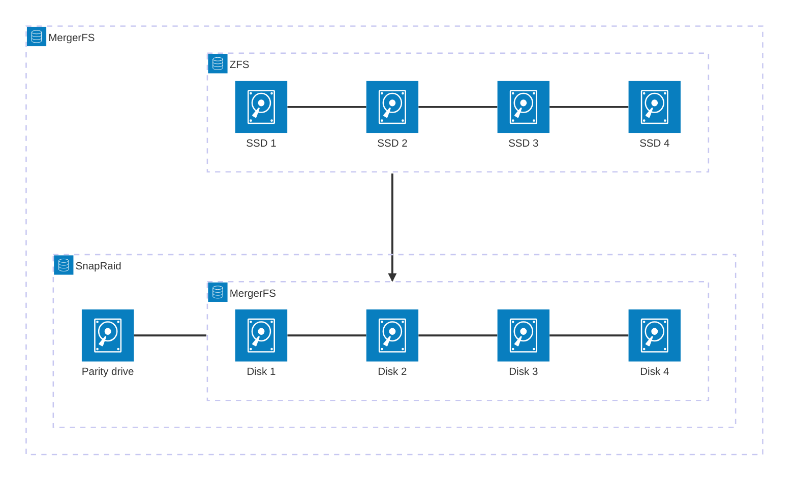
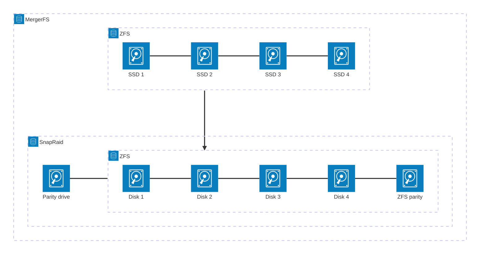

I've been really happy running TrueNAS Scale in my lab. It has warned me every time a drive has failed, I have never lost any data, and the scrubs, resilvers, drive swaps, replications and snapshots have always worked flawlessly. But reliability is boring.

After being informed of it by [Wolfgang](https://www.youtube.com/watch?v=qyGbkEtjJ90), I thought that going the [Perfect Media Server](https://perfectmediaserver.com/) route would be great, if only for the "tiered storage", allowing for HDD spindown, and thus lowered power consumption.

# Hardware
I'm reusing most of my current server's hardware:
- A Xeon E3-1225v6 (4c/4t) on an [AsRock Rack E3C236D4M-4L](https://www.asrockrack.com/general/productdetail.asp?Model=E3C236D4M-4L#Specifications)
- 5 x 10 TB Seagate Exos ST10000NM0096
- A Samsung 650, 120GB SSD
- An LSI 9211-8i HBA
- A Mellanox ConnectX-3 10 GBit adapter
- And a Seasonic Focus Gold 850W PSU

However... I want tiered storage. So I'm going to need SSDs. Oh look at that, [a Level1Techs video about cheap enterprise SSDs](https://www.youtube.com/watch?v=B0APH46b3_0). So yeah, I picked up 4 x 800GB Toshiba branded `PX04SVB080`.

The plan
====
PMS (Perfect Media Server) uses a combination of MergerFS and Snapraid (for more information, check out the explanation on the technologies on [PMS' website](https://perfectmediaserver.com/02-tech-stack/mergerfs/)). The layout I'm going for is as follows:

# Preparation
## Backing up from TrueNAS
The current TrueNAS pool is a 5-wide RAIDZ1 zfs pool. I like the idea of having 4 data drives and one parity, however, I unfortunately can't keep the zfs pool as is. Snapraid can absolutely utilize that layout, but it would mean keeping the 5 drive pool, and adding a 6th drive for parity. Which would be redundant, as ZFS also keeps a parity drive, which itself would also get parity checksums placed on the snapraid parity drive.

It would be much easier to migrate, for sure, but adding an extra drive for fun, and getting 2/3rds drive efficiency does feel inefficient. So I have no choice but to backup my pool, break the RAIDZ1, format each drive to a new filesystem (XFS in my case), create the MergerFS pool and only then transfer everything back. This will prove to be fun. Thankfully I already own the drives I need to backup my base pool. so no need to buy anything there.

## Formatting NetApp drives
The `PX04SVB080` drives that I bought came in a NetApp drive tray, which houses an interposer for SAS to SATA, among others. NetApp, in their infinite wisdom, only accept drives formatted to a 520b (emulated) sector size, which is non-standard. For better compatibility with *everything else*, I will need to [format the drives to a more widespread sector size](https://www.truenas.com/community/threads/troubleshooting-disk-format-warnings-in-truenas-scale.106051/). For these drives, it will be 4096b (aka 4Kn, their native sector size).

# Configuring the PMS
